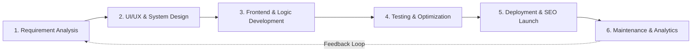

# 📋 Software Development Life Cycle (SDLC) Specification Document
## Project: Saurabh's Elite Freelance Portfolio & Client Acquisition Platform

---

### 1. Overview & Objective
This document outlines the complete Software Development Life Cycle (SDLC) for developing **Saurabh's Freelance Platform**. The objective of this project is to build a top-tier, high-converting freelance web application that positions Saurabh as a premier freelance developer/engineer, demonstrates technical authority through dynamic project case studies, and drives inbound client inquiries and contract deals.

---

### 2. SDLC Model Chosen: Agile Iterative & Incremental Model
We adopt an **Agile Iterative Model** divided into 6 distinct stages. This ensures rapid prototyping, user feedback integration, step-by-step feature delivery, and rigorous quality benchmarks.

---

### 3. SDLC Phase Breakdown

#### Phase 1: Requirements Engineering & Analysis
- **Target Audience**: 
  - Startup Founders & CTOs seeking contract developers.
  - Small/Medium Business owners needing custom web/software solutions.
  - Agencies looking for dependable white-label development talent.
- **Core Value Proposition**:
  - Highlighting Saurabh’s problem-solving skills, speed to market, clean code standards, and customer satisfaction record.
- **Functional Requirements (FR)**:
  1. **Hero & Personal Brand Section**: High-impact headline, dynamic badge, live availability indicator, CTA buttons ("Hire Me" / "Explore Work"), quick stats counter.
  2. **Interactive Service Matrix**: Detailed breakdown of services (e.g., Full-Stack Web Development, Custom Web Apps, UI/UX Engineering, API Integration, AI Automation & Performance Optimization).
  3. **Showcase / Portfolio Gallery**:
     - Categorized filter tabs (All, Full-Stack, Frontend, Backend, UI/UX, AI/Tools).
     - Rich Project Cards with live demo links, GitHub source links, tech stack pills, problem/solution metrics.
     - Interactive Case Study Modal for in-depth project breakdown.
  4. **Skills & Tech Stack Visualization**: Interactive categorized skill chips with proficiency levels and tech badges (React, Node.js, Python, TypeScript, Next.js, Tailwind, Postgres, Cloud, etc.).
  5. **Interactive Project Cost / Estimate Calculator**: Let prospective clients estimate project cost based on scope (Landing page, Full-stack app, E-commerce, Custom AI tool) to qualify leads before booking.
  6. **Work Process / Methodology Roadmap**: Visual 4-step workflow (1. Discovery & Strategy $\rightarrow$ 2. Wireframe & Design $\rightarrow$ 3. Build & Test $\rightarrow$ 4. Launch & Scale).
  7. **Social Proof & Client Testimonials**: Verified ratings, review slider/cards, logos of past collaborators/companies.
  8. **Lead Capture & Contact Engine**:
     - Direct Contact Form with instant validation, spam protection, and pre-formatted project inquiry details.
     - Direct Schedule / Book a Call integration (Calendly / WhatsApp / Email triggers).
  9. **Interactive FAQ Accordion**: Answering common client questions (pricing, timelines, IP rights, post-launch support).
  10. **Theme Switcher & Quick Navigation**: Smooth dark/light mode toggle with preference persistence, sticky glassmorphic navbar with mobile responsive drawer.

- **Non-Functional Requirements (NFR)**:
  - **Performance**: 95+ Google Lighthouse score, < 1.2s First Contentful Paint.
  - **Aesthetics & UX**: Sleek modern tech dark aesthetic with subtle neon/indigo gradients, smooth micro-interactions, responsive typography.
  - **Accessibility**: WCAG 2.1 AA compliant contrast ratios and keyboard navigation.
  - **SEO & Meta Optimization**: OpenGraph metadata, JSON-LD Schema (Person & WebSite), semantic HTML5 tags.

---

#### Phase 2: System Architecture & UI/UX Design System
- **Design Tokens**:
  - *Primary Theme*: Deep Tech Charcoal / Cosmic Obsidian (`#0B0F17`, `#111827`)
  - *Accent & Glows*: Vibrant Electric Indigo (`#6366F1`) & Cyber Cyan (`#06B6D4`)
  - *Typography*: Google Fonts `Outfit` (Headings & Brand) + `Plus Jakarta Sans` / `Inter` (Body text)
  - *UI Style*: Glassmorphism (frosted glass blur `backdrop-filter: blur(16px)`), crisp border glows, clean Bento-Grid card layouts.
- **Information Architecture**:
  - `Header / Nav` $\rightarrow$ `Hero Banner` $\rightarrow$ `Trust / Metrics Bar` $\rightarrow$ `Services & Solutions` $\rightarrow$ `Featured Projects` $\rightarrow$ `Skills Ecosystem` $\rightarrow$ `Working Process` $\rightarrow$ `Estimate Calculator` $\rightarrow$ `Testimonials` $\rightarrow$ `FAQ` $\rightarrow$ `Contact & Lead Capture` $\rightarrow$ `Footer`

---

#### Phase 3: Development & Implementation Strategy
- **File & Code Structure**:
  - `index.html`: Semantic, SEO-optimized markup structure.
  - `styles/`:
    - `main.css`: Core design system, CSS variables, utility classes, typography, animations.
    - `components.css`: Specific styling for bento grids, modal dialogs, calculators, sliders, forms.
    - `responsive.css`: Custom fluid breakpoints for mobile, tablet, desktop, and ultra-wide screens.
  - `scripts/`:
    - `main.js`: Smooth scroll, intersection observer animations, mobile nav toggle.
    - `projects-data.js`: Centralized data store for projects, case studies, images, and live links.
    - `calculator.js`: Real-time project cost estimator logic.
    - `contact.js`: Form validation, feedback states, and contact dispatch.
    - `theme.js`: Dark/Light mode engine with localStorage cache.
  - `assets/`:
    - `images/`: High-resolution project mockups, profile avatar, client logos, SVG icons.

---

#### Phase 4: Quality Assurance & Testing Strategy
1. **Cross-Browser Compatibility**: Chrome, Firefox, Safari, Edge, Mobile Safari, Android Chrome.
2. **Responsive Viewport Testing**: 320px (Mobile S), 375px (iPhone), 768px (iPad/Tablet), 1024px (Laptop), 1440px+ (Desktop).
3. **Form Integrity**: Validation testing on empty fields, invalid emails, payload formatting.
4. **Performance & Audit**: Testing via Lighthouse for SEO, PWA readiness, Best Practices, and Web Vitals (LCP, FID, CLS).

---

#### Phase 5: Deployment, SEO & Release Plan
1. **Repository Setup & Version Control**: Git versioning with clean commit history.
2. **Hosting Setup**: Zero-cost, high-speed CDN deployment (e.g., GitHub Pages, Vercel, or Netlify).
3. **SEO Indexing**: Sitemap generation, `robots.txt`, rich snippets, Twitter card & LinkedIn card preview verification.

---

#### Phase 6: Post-Launch Maintenance & Iteration
- Adding new client case studies seamlessly via the modular data file.
- Tracking engagement using privacy-friendly analytics.
- Regular dependency and asset audits.

---
*Document Version: 1.0.0 | Author: Antigravity AI Engineering Team | Status: Ready for Review & Execution*
